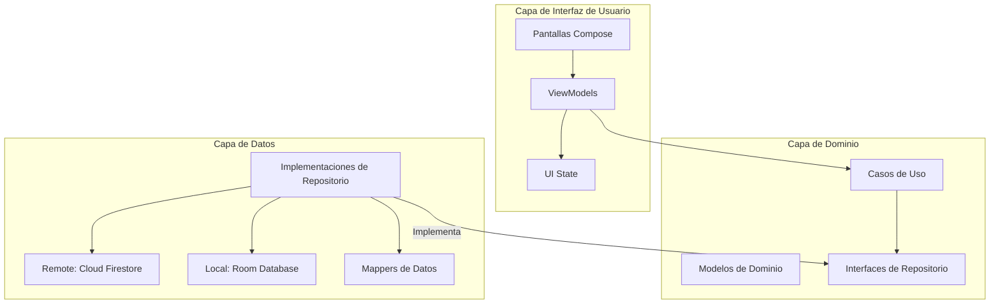

# Reporte Técnico: Gestor Personal de Tareas (Task Manager)
**Arquitectura MVVM, Firebase Cloud Firestore y Room Database**

---

## 1. Introducción
El presente documento detalla la arquitectura, el diseño y la implementación de la aplicación **Task Manager**, una solución móvil robusta desarrollada para la plataforma Android. El objetivo principal del sistema es permitir a los usuarios gestionar tareas de forma eficiente, integrando capacidades de sincronización en la nube y persistencia local para garantizar la disponibilidad de la información en diversos escenarios de conectividad.

La aplicación ha sido diseñada bajo estándares de ingeniería de software modernos, priorizando la escalabilidad, la mantenibilidad y una experiencia de usuario fluida mediante el uso de **Jetpack Compose**.

---

## 2. Tecnologías Utilizadas y Justificación

Para el desarrollo de este sistema se seleccionó un conjunto de tecnologías de vanguardia que garantizan un rendimiento óptimo y una arquitectura escalable:

*   **Kotlin (v2.0.21):** Lenguaje de programación oficial para Android, elegido por su concisión, seguridad nula (null safety) y excelente soporte para corrutinas.
*   **Jetpack Compose:** Toolkit moderno para la construcción de interfaces de usuario declarativas, permitiendo un desarrollo más rápido y componentes altamente reutilizables.
*   **Firebase Authentication:** Proporciona un sistema de gestión de identidades seguro y escalable, permitiendo el registro y acceso de usuarios sin necesidad de gestionar servidores propios.
*   **Cloud Firestore:** Base de datos NoSQL basada en la nube que permite la sincronización en tiempo real entre múltiples dispositivos y una estructura de datos flexible.
*   **Room Database:** Librería de persistencia de Jetpack que proporciona una capa de abstracción sobre SQLite, utilizada en este proyecto para la gestión de borradores de tareas locales.
*   **Hilt (Dependency Injection):** Framework construido sobre Dagger para simplificar la inyección de dependencias en Android, facilitando el desacoplamiento de componentes y la realización de pruebas unitarias.
*   **Coroutines & Flow:** Implementación de programación asíncrona y reactiva para manejar flujos de datos y operaciones de red/base de datos sin bloquear el hilo principal de la interfaz de usuario.

---

## 3. Arquitectura del Sistema

La aplicación sigue los principios de **Clean Architecture** combinados con el patrón de diseño **MVVM (Model-View-ViewModel)**. Esta separación de responsabilidades asegura que la lógica de negocio sea independiente de la interfaz de usuario y de las fuentes de datos.

### Diagrama de Arquitectura (Mermaid)

---

## 4. Estructura de Paquetes

El proyecto se organiza bajo el paquete raíz `com.example.myproyectfinal`, siguiendo una estructura por capas:

*   **`data/`**: Contiene la implementación del acceso a datos.
    *   `local/`: Configuración de Room, Entidades (`TaskDraftEntity`) y DAOs.
    *   `remote/`: Modelos de datos para Firestore (`TaskDocument`).
    *   `repository/`: Implementaciones concretas de las interfaces de repositorio, coordinando fuentes locales y remotas.
*   **`domain/`**: El núcleo de la lógica de negocio.
    *   `model/`: Clases de datos puras (`Task`, `User`).
    *   `repository/`: Definiciones de contratos para el acceso a datos.
    *   `usecase/`: Lógica de negocio específica (ej. `LoginUserUseCase`, `PublishDraftUseCase`).
*   **`di/`**: Módulos de Hilt para la provisión de dependencias (Firebase, Database, Repositorios).
*   **`ui/`**: Componentes de la interfaz de usuario.
    *   `screens/`: Componibles de pantalla completa.
    *   `viewmodel/`: Lógica de presentación y gestión del estado de la UI.
    *   `navigation/`: Configuración de rutas y flujo de navegación.
    *   `state/`: Definiciones de estados inmutables para la UI.

---

## 5. Interfaz del Sistema (Manual de Usuario)

A continuación, se describen los módulos principales de la aplicación con sus respectivos flujos de interacción.

### 5.1 Acceso y Registro
El sistema implementa un flujo de seguridad obligatorio. Los usuarios deben autenticarse para acceder a sus tareas personales.

> **[IMAGEN: Pantalla de Inicio de Sesión (Login)]**
> *Descripción: Interfaz para el ingreso de credenciales (correo y contraseña). Incluye validaciones y acceso directo al registro.*

> **[IMAGEN: Pantalla de Registro (Register)]**
> *Descripción: Formulario para la creación de nuevas cuentas de usuario vinculadas a Firebase Auth.*

### 5.2 Gestión de Tareas
Una vez autenticado, el usuario accede al panel principal donde puede visualizar y administrar sus actividades.

> **[IMAGEN: Listado de Tareas (Task List)]**
> *Descripción: Vista principal que muestra las tareas sincronizadas desde Firestore. Permite filtrar por estado y eliminar registros.*

### 5.3 Formulario de Nueva Tarea y Borradores
El sistema permite la creación ágil de tareas. Si el usuario no desea publicar la tarea inmediatamente, puede guardarla como un borrador local (Room).

> **[IMAGEN: Formulario de Nueva Tarea (New Task)]**
> *Descripción: Interfaz para ingresar título y descripción de la tarea, con opciones para "Guardar en la Nube" o "Guardar como Borrador".*

---

## 6. Justificación Técnica del Diseño

### Gestión de Estado
Se utiliza `StateFlow` dentro de los ViewModels para emitir estados inmutables hacia la UI. El uso de una clase sellada `UiState` permite manejar de forma elegante los estados de **Carga (Loading)**, **Éxito (Success)** y **Error**, mejorando la robustez de la aplicación ante fallos de red.

### Sincronización Remota vs Persistencia Local
La decisión de usar Room para borradores y Firestore para tareas finales se basa en el requerimiento de separar el trabajo en progreso de la información consolidada. Firestore garantiza la ubicuidad de los datos finales, mientras que Room ofrece una latencia cero para el guardado frecuente de borradores sin necesidad de conexión activa a internet.

---

## 7. Conclusión
La implementación del **Task Manager** demuestra la aplicación efectiva de patrones de diseño modernos en Android. La integración de servicios de Firebase con persistencia local mediante Room proporciona una solución equilibrada entre potencia y eficiencia. La arquitectura desacoplada garantiza que el sistema pueda evolucionar fácilmente en el futuro, permitiendo la adición de nuevas funcionalidades con un impacto mínimo en el código existente.

---
**Desarrollado por:** Oscar
**Fecha de entrega:** 21 de Septiembre de 2026
